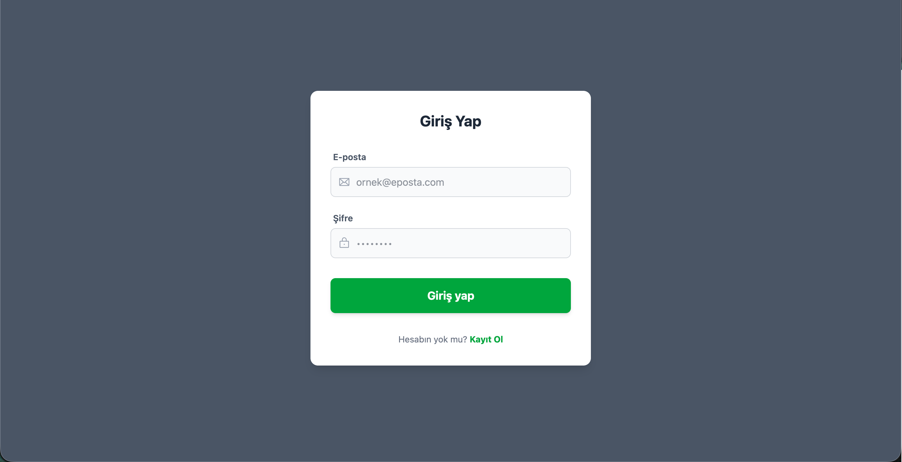
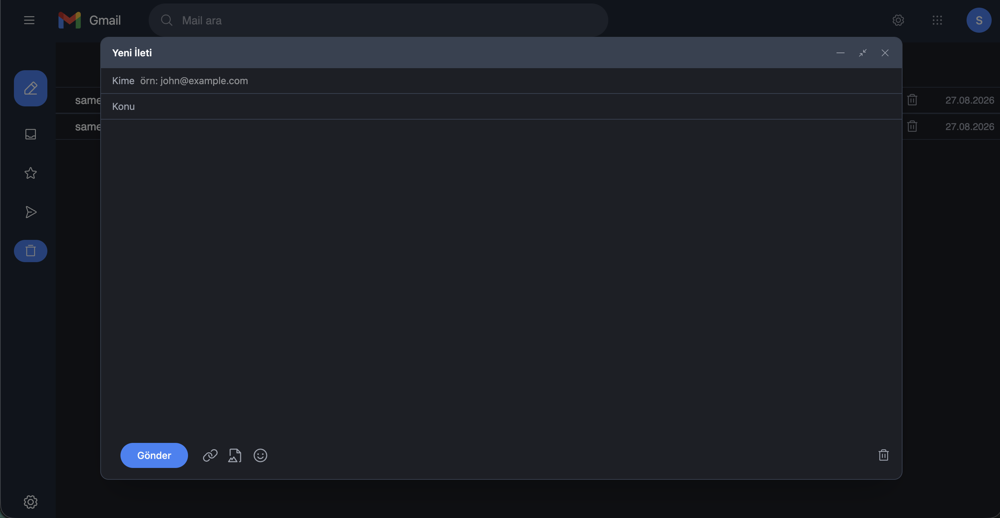
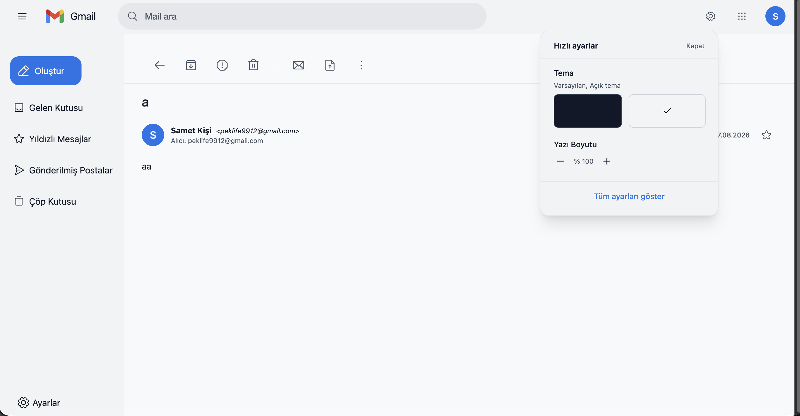
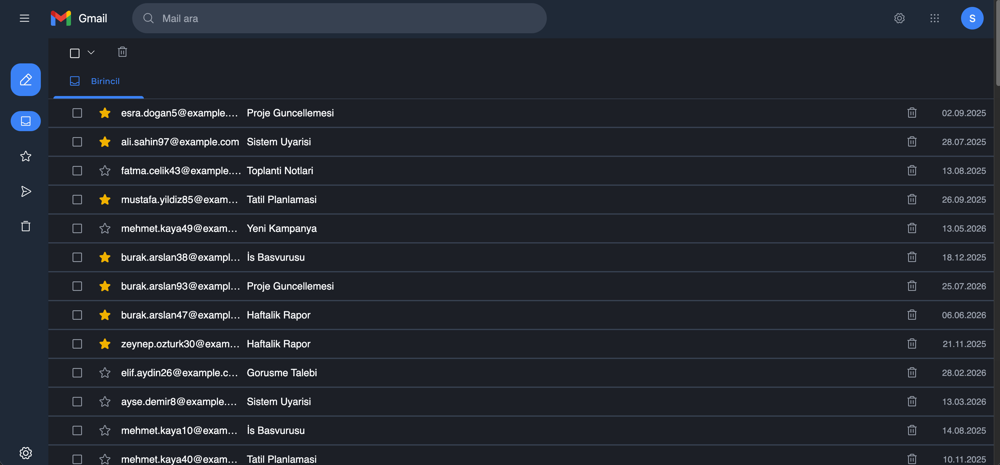
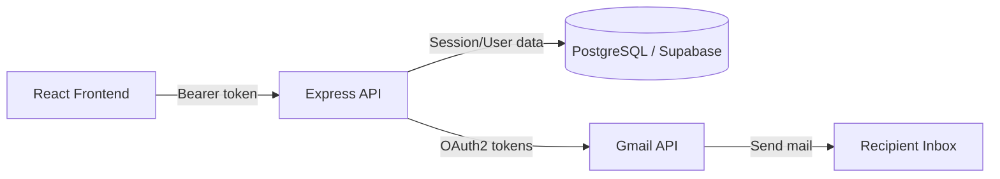

# 📬 Gmail Clone

A full-stack Gmail clone with a real inbox experience: compose, folders, trash, starring, and Gmail account integration for sending mail — built as a way to go deep on React state management, auth architecture, and API integration.

## ✨ Features

- Inbox, folders, and Trash with bulk actions (select, delete, restore)
- Starred mail with cross-component sync
- Infinite-scroll, virtualized mail list (via `virtua` + `virtua-restoration`, with scroll-position cache restoration) for smooth performance on large mailboxes
- Rich text compose toolbar with a fixed-position popover UI
- Recipient autocomplete
- Mail search
- Live "new mail" banner via Supabase Realtime (`postgres_changes` subscriptions)
- Undo toast on delete (single and bulk)
- Dark/light theme toggle (persisted in `localStorage`)
- Sending real email via the Gmail API using the user's own Google account (OAuth2)
- Secure session-based authentication with single-session enforcement

## 📸 Screenshots

| Login | Compose |
|---|---|
|  |  |

| MailIn | Main |
|---|---|
|  |  |

## 🏗️ Tech Stack

**Frontend** (`/frontend`)
- React 19 + TypeScript + Vite
- Zustand (slice-based store: folders, star, trash)
- Tailwind CSS 4 + Phosphor Icons
- `virtua` + `virtua-restoration` for virtualized list rendering with scroll-cache restoration
- Supabase Realtime (`postgres_changes`) for live new-mail updates
- `react-hot-toast` for toasts (send/delete/undo feedback)
- DOMPurify for sanitizing email HTML (XSS protection)

**Backend** (`/backend`)
- Node.js + Express 5 (ES Modules)
- PostgreSQL via Supabase (`@supabase/supabase-js`, `pg`)
- Better Auth — bearer token sessions with sliding refresh and single-session enforcement
- Google OAuth2 + Gmail API for sending mail
- Nodemailer
- `express-rate-limit` + CORS

## 🔐 Auth Architecture

- Bearer-token sessions (not cookies) issued by Better Auth, stored in PostgreSQL
- Sliding session refresh, with an `active_tokens` table enforcing a single active session per user
- Distinct `NO_TOKEN` vs `SESSION_INVALID` error states for clean client-side handling
- Google account tokens (for Gmail sending) are stored and refreshed independently of the app's own session

## 🧭 Architecture



## 🔌 API Overview

| Method | Endpoint | Description |
|---|---|---|
| `POST` | `/api/auth/*` | Sign up / sign in / session handling (Better Auth) |
| `GET` | `/api/mail` | List mail for the current folder (paginated) |
| `GET` | `/api/mail/:id` | Get a single mail item |
| `POST` | `/api/mail/send` | Send a new email via the Gmail API |
| `DELETE` | `/api/mail/:id` | Move mail to Trash |
| `POST` | `/api/mail/:id/restore` | Restore mail from Trash |
| `POST` | `/api/mail/:id/star` | Toggle starred state |
| `GET` | `/api/folders` | List folders |
| `GET` | `/search?q=` | Search mail by query string |

## 📂 Project Structure

```
gmail-clone/
├── frontend/          # React + Vite app
│   ├── src/
│   │   ├── store/     # Zustand slices (folders, star, trash)
│   │   ├── hooks/     # useMailPagination, etc.
│   │   └── ...
├── backend/           # Express API
│   ├── routes/
│   ├── middleware/    # requireAuth, requireAuthBasic
│   └── ...
```

## ⚡ Getting Started

### Prerequisites
- Node.js 18+
- A Supabase (PostgreSQL) project
- A Google Cloud project with the Gmail API enabled (for sending mail)

### 1. Backend

```bash
cd backend
npm install
cp .env.example .env   # fill in Supabase, Better Auth, and Google OAuth credentials
npm start
```

### 2. Frontend

```bash
cd frontend
npm install
cp .env.example .env   # point this at your backend URL
npm run dev
```

The app should now be running locally, with the frontend talking to your backend API.

## 🔧 Environment Variables

**Backend**
| Variable | Description |
|---|---|
| `DATABASE_URL` | Supabase/PostgreSQL connection string |
| `BETTER_AUTH_SECRET` | Secret used to sign sessions |
| `GOOGLE_CLIENT_ID` / `GOOGLE_CLIENT_SECRET` | For Gmail OAuth2 |
| `TRUSTED_ORIGINS` | Allowed CORS origins |

**Frontend**
| Variable | Description |
|---|---|
| `VITE_API_URL` | Base URL of the backend API |

## 🧯 Troubleshooting

- **`invalid_grant` from Google OAuth** — usually a stale or revoked refresh token; disconnect and reconnect the Google account, or check that your system clock is correct.
- **Redirect URI mismatch** — make sure the redirect URI in Google Cloud Console exactly matches what's set in your backend `.env` (including trailing slashes and http vs https).
- **`SESSION_INVALID` right after login** — check that `TRUSTED_ORIGINS` in the backend includes your frontend's exact origin.
- **Multiple sessions logging each other out** — expected behavior: the `active_tokens` table enforces a single active session per user by design.

## 🧑‍💻 About This Project

This started as a way to learn React from the ground up — state management, component lifecycle, routing — by rebuilding something familiar and deceptively complex: Gmail. It grew into a deeper dive on session/auth architecture (bearer tokens, sliding sessions, single-session enforcement) and real third-party API integration via Google's Gmail API.

## 🗺️ Roadmap / Known Limitations

- Mail is read from the app's own database rather than live-synced from Gmail (no push notifications) — this avoids Google's stricter OAuth verification requirements for read-access scopes
